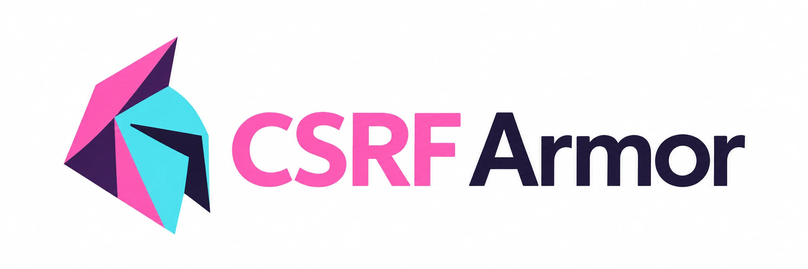

# CSRF Armor

<picture>
  <source media="(prefers-color-scheme: dark)" srcset="./assets/logo/logo-large-dark.webp" />
  
</picture>

[](https://github.com/muneebs/csrf-armor/actions/workflows/codeql-analysis.yml)
[](https://github.com/muneebs/csrf-armor/actions/workflows/ci.yml)
[](https://badge.fury.io/js/%40csrf-armor%2Fcore)
[](https://opensource.org/licenses/MIT)

CSRF protection for Node.js and edge runtimes, with a framework-agnostic core and ready-made adapters for Next.js, Express and Nuxt.

- **Framework agnostic**: one core with no framework code; adapters for Next.js, Express and Nuxt, or [write your own](./docs/custom-adapters.md).
- **Edge Runtime compatible**: the core and the Next.js middleware use only Web APIs (Web Crypto, `Headers`, `Request`). The Express and Nuxt adapters target Node.js.
- **Zero dependencies**: the core has none; each adapter depends only on the core and its framework.
- **Five strategies**: signed double submit (default), hybrid, signed token, origin check and double submit.
- **TypeScript and ESM**: fully typed, ESM-only packages.

## Packages

| Package | Use it for | Install |
|---|---|---|
| [`@csrf-armor/nextjs`](./packages/nextjs) | Next.js middleware, React provider and hook | `npm i @csrf-armor/nextjs` |
| [`@csrf-armor/express`](./packages/express) | Express middleware | `npm i @csrf-armor/express` |
| [`@csrf-armor/nuxt`](./packages/nuxt) | Nuxt 3/4 module with server middleware and composables | `npm i @csrf-armor/nuxt` |
| [`@csrf-armor/core`](./packages/core) | Building an adapter for another framework | `npm i @csrf-armor/core` |

Each package README has a quick start for that framework.

## How it works

1. Safe requests (`GET`, `HEAD`, `OPTIONS`) receive a token in a cookie and an `X-CSRF-Token` response header.
2. Your client sends the token back on unsafe requests, in the `X-CSRF-Token` header or a `csrf_token` form field.
3. The middleware validates it with the configured strategy and rejects the request if it fails.

```typescript
// Same options in every package
{
  strategy: 'signed-double-submit', // default
  secret: process.env.CSRF_SECRET,  // required in production
  excludePaths: ['/api/webhooks'],
}
```

## Documentation

- [Strategies](./docs/strategies.md): how each strategy works and which to choose
- [Configuration](./docs/configuration.md): every option, defaults, token sources, exclusions, session binding and troubleshooting
- [Security guide](./docs/security.md): production checklist and threat model
- [Writing an adapter](./docs/custom-adapters.md): support another framework with `@csrf-armor/core`
- [Core API reference](./docs/api.md): every export of `@csrf-armor/core`
- [Migration](./docs/migration.md): moving from csurf, lusca, next-csrf and others

## Security

To report a vulnerability, follow the [security policy](./SECURITY.md). Please don't open a public issue.

## Development

```bash
git clone https://github.com/muneebs/csrf-armor.git
cd csrf-armor
pnpm install
```

```bash
pnpm build            # Build all packages
pnpm test             # Run all tests
pnpm type-check       # Type-check all packages
pnpm lint             # Lint and fix
pnpm security:check   # Custom security checks
```

```
csrf-armor/
├── packages/
│   ├── core/       # Framework-agnostic core
│   ├── express/    # Express adapter
│   ├── nextjs/     # Next.js adapter
│   └── nuxt/       # Nuxt module
├── docs/           # Shared documentation
├── examples/       # Private example apps (not published)
└── scripts/        # Release and security scripts
```

## Contributing

Contributions are welcome, especially new framework adapters, security reviews and documentation fixes.

1. Fork the repository and create a branch.
2. Make your change with tests in `packages/*/tests`.
3. Add a changeset with `pnpm changeset` if a published package changes.
4. Open a pull request.

Questions and ideas go in [Discussions](https://github.com/muneebs/csrf-armor/discussions); bugs in [Issues](https://github.com/muneebs/csrf-armor/issues).

## License

MIT © [Muneeb Samuels](https://github.com/muneebs)
