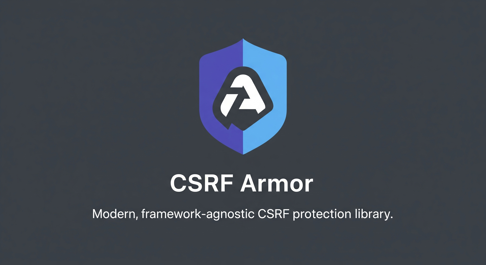

# @csrfx/core



Framework-agnostic CSRF protection core functionality.

## Installation

```bash
npm install @csrf-armor/core
```

## Overview

This package provides the core CSRF protection logic that can be adapted to any framework. It implements multiple security strategies with optimized token management and provides a clean abstraction for framework-specific implementations.

## Features

- 🔐 **Multiple CSRF Strategies**: Signed Token, Double Submit, Signed Double Submit, Origin Check, Hybrid
- 🚀 **Edge Runtime Compatible**: Uses Web Crypto API for modern environments
- 📦 **Zero Dependencies**: Lightweight and secure core library
- 🔧 **Framework Agnostic**: Clean adapter pattern for any framework
- ⚡ **High Performance**: Optimized cryptographic operations
- 🛡️ **Strategy-Aware Token Management**: Intelligent token distribution per strategy
- ✅ **Well Tested**: Comprehensive test coverage with security focus

---

## Quick Start

### Creating a Custom Adapter

```typescript
import { CsrfAdapter, CsrfRequest, CsrfResponse, createCsrfProtection } from '@csrfx/core';

class MyFrameworkAdapter implements CsrfAdapter<MyRequest, MyResponse> {
  extractRequest(req: MyRequest): CsrfRequest {
    return {
      method: req.method,
      url: req.url,
      headers: new Map(Object.entries(req.headers)),
      cookies: new Map(Object.entries(req.cookies)),
    };
  }

  applyResponse(res: MyResponse, csrfResponse: CsrfResponse): MyResponse {
    // Apply headers and cookies to your framework's response
    if (csrfResponse.headers instanceof Map) {
      for (const [key, value] of csrfResponse.headers) {
        res.setHeader(key, value);
      }
    }

    if (csrfResponse.cookies instanceof Map) {
      for (const [name, { value, options }] of csrfResponse.cookies) {
        res.setCookie(name, value, options);
      }
    }

    return res;
  }

  async getTokenFromRequest(
    request: CsrfRequest, 
    config: RequiredCsrfConfig
  ): Promise<string | undefined> {
    const headers = request.headers instanceof Map 
      ? request.headers 
      : new Map(Object.entries(request.headers));

    // Try header first
    const headerValue = headers.get(config.token.headerName.toLowerCase());
    if (headerValue) return headerValue;

    // Try form data if available
    if (request.body && typeof request.body === 'object') {
      const body = request.body as Record<string, unknown>;
      const formValue = body[config.token.fieldName];
      if (typeof formValue === 'string') return formValue;
    }

    return undefined;
  }
}

// Use the adapter
const adapter = new MyFrameworkAdapter();
const csrfProtection = createCsrfProtection(adapter, {
  strategy: 'signed-double-submit',
  secret: 'your-secret-key-32-chars-minimum',
});

const result = await csrfProtection.protect(request, response);
if (result.success) {
  // Request is valid, proceed
  console.log('CSRF protection passed');
} else {
  // Handle validation failure
  console.error('CSRF validation failed:', result.reason);
}
```

### Direct Validation

```typescript
import { validateRequest, generateSignedToken, generateNonce } from '@csrfx/core';

// Generate different types of tokens
const signedToken = await generateSignedToken('secret', 3600);
const unsignedToken = generateNonce(32);

// Validate a request with custom logic
const result = await validateRequest(request, config, async (req, cfg) => {
  // Your custom token extraction logic
  return req.headers.get(cfg.token.headerName.toLowerCase());
});

if (result.isValid) {
  console.log('Request is valid');
} else {
  console.error('Validation failed:', result.reason);
}
```

---

## CSRF Strategies

### 1. Signed Token

```typescript
{
  strategy: 'signed-token',
  secret: 'your-32-char-secret',
  token: { expiry: 3600 }
}
```

**How it works:**
- Generates HMAC-signed tokens with expiration timestamps
- Stateless validation using cryptographic signatures
- Token format: `{timestamp}.{nonce}.{signature}`

**Best for:** APIs, microservices, stateless applications

### 2. Double Submit Cookie

```typescript
{
  strategy: 'double-submit'
}
```

**How it works:**
- Same unsigned token stored in cookie and submitted in header/form
- Relies on Same-Origin Policy for protection
- No cryptographic operations required

**Best for:** Traditional web applications, development environments

### 3. Signed Double Submit Cookie

```typescript
{
  strategy: 'signed-double-submit',
  secret: 'your-32-char-secret'
}
```

**How it works:**
- Unsigned token sent to client and stored in client-accessible cookie
- Signed version stored in server-only httpOnly cookie for validation
- Client submits unsigned token, server verifies against signed cookie
- Combines cryptographic protection with double-submit pattern

**Token Distribution:**
- Client gets: unsigned token (in header + client cookie)
- Server stores: signed token (in server-only cookie)
- Validation: server verifies unsigned submission matches signed cookie content

**Best for:** High-security applications, financial services, e-commerce

### 4. Origin Check

```typescript
{
  strategy: 'origin-check',
  allowedOrigins: ['https://yourdomain.com']
}
```

**How it works:**
- Validates Origin and Referer headers against allowed list
- Minimal computational overhead
- Relies on browser security headers

**Best for:** APIs with known client origins, mobile app backends

### 5. Hybrid (Signed Token + Origin Check)

```typescript
{
  strategy: 'hybrid',
  secret: 'your-32-char-secret',
  allowedOrigins: ['https://yourdomain.com']
}
```

**How it works:**
- Combines signed token validation with origin checking
- Multiple layers of protection
- Highest security but more computational overhead

**Best for:** Maximum security requirements, enterprise applications

---

## Configuration

```typescript
interface CsrfConfig {
  strategy?: 'double-submit' | 'signed-double-submit' | 'signed-token' | 'origin-check' | 'hybrid';
  secret?: string;                    // Required for signed strategies
  
  token?: {
    expiry?: number;                  // Token expiry in seconds (default: 3600)
    headerName?: string;              // Header name (default: 'X-CSRF-Token')
    fieldName?: string;               // Form field name (default: 'csrf_token')
  };
  
  cookie?: {
    name?: string;                    // Cookie name (default: 'csrf-token')
    secure?: boolean;                 // Secure flag (default: true)
    httpOnly?: boolean;               // HttpOnly flag (default: false)
    sameSite?: 'strict' | 'lax' | 'none'; // SameSite (default: 'lax')
    path?: string;                    // Path (default: '/')
    domain?: string;                  // Domain (optional)
    maxAge?: number;                  // Max age in seconds (optional)
  };
  
  allowedOrigins?: readonly string[]; // Allowed origins for origin-check
  excludePaths?: readonly string[];   // Paths to exclude from protection
  skipContentTypes?: readonly string[]; // Content types to skip
}
```

### Default Configuration

```typescript
import { DEFAULT_CONFIG } from '@csrfx/core';

console.log(DEFAULT_CONFIG);
// {
//   strategy: 'hybrid',
//   secret: 'default-secret-change-this', // ⚠️ Change in production!
//   token: {
//     expiry: 3600,
//     headerName: 'X-CSRF-Token',
//     fieldName: 'csrf_token'
//   },
//   cookie: {
//     name: 'csrf-token',
//     secure: true,
//     httpOnly: false,
//     sameSite: 'lax',
//     path: '/'
//   },
//   allowedOrigins: [],
//   excludePaths: [],
//   skipContentTypes: []
// }
```

---

## API Reference

### Classes

#### CsrfProtection<TRequest, TResponse>

Main protection class that handles token generation, validation, and response modification.

```typescript
class CsrfProtection<TRequest, TResponse> {
  constructor(adapter: CsrfAdapter<TRequest, TResponse>, config?: CsrfConfig);
  
  async protect(request: TRequest, response: TResponse): Promise<{
    success: boolean;
    response: TResponse;
    token?: string;
    reason?: string;
  }>;
}
```

#### createCsrfProtection(adapter, config)

Factory function for creating CSRF protection instances.

```typescript
function createCsrfProtection<TRequest, TResponse>(
  adapter: CsrfAdapter<TRequest, TResponse>,
  config?: CsrfConfig
): CsrfProtection<TRequest, TResponse>;
```

### Cryptographic Functions

#### generateSignedToken(secret, expiry)

Generate an HMAC-signed token with expiration.

```typescript
async function generateSignedToken(secret: string, expirySeconds: number): Promise<string>;

// Example
const token = await generateSignedToken('my-secret', 3600);
// Returns: "1234567890.abcdef123456.signature-hash"
```

#### parseSignedToken(token, secret)

Parse and validate a signed token.

```typescript
async function parseSignedToken(token: string, secret: string): Promise<TokenPayload>;

// Example
try {
  const payload = await parseSignedToken(token, 'my-secret');
  console.log('Expires at:', new Date(payload.exp * 1000));
  console.log('Nonce:', payload.nonce);
} catch (error) {
  if (error instanceof TokenExpiredError) {
    console.log('Token has expired');
  }
}
```

#### signUnsignedToken(token, secret)

Sign an unsigned token (used in signed-double-submit).

```typescript
async function signUnsignedToken(unsignedToken: string, secret: string): Promise<string>;

// Example
const unsigned = generateNonce(32);
const signed = await signUnsignedToken(unsigned, 'my-secret');
// Returns: "original-token.signature-hash"
```

#### verifySignedToken(signedToken, secret)

Verify a signed token and extract the original unsigned token.

```typescript
async function verifySignedToken(signedToken: string, secret: string): Promise<string>;

// Example
try {
  const originalToken = await verifySignedToken(signedToken, 'my-secret');
  console.log('Original unsigned token:', originalToken);
} catch (error) {
  console.log('Invalid signature');
}
```

#### generateNonce(length)

Generate a cryptographically secure random nonce.

```typescript
function generateNonce(length = 16): string;

// Example
const nonce = generateNonce(32); // 32 bytes = 64 hex characters
console.log('Random nonce:', nonce);
```

### Validation Functions

#### validateRequest(request, config, getToken)

Validate a CSRF request using the specified strategy.

```typescript
async function validateRequest(
  request: CsrfRequest,
  config: RequiredCsrfConfig,
  getTokenFromRequest: (req: CsrfRequest, config: RequiredCsrfConfig) => Promise<string | undefined>
): Promise<ValidationResult>;
```

### Interfaces

#### CsrfAdapter<TRequest, TResponse>

Framework adapter interface for integrating with different web frameworks.

```typescript
interface CsrfAdapter<TRequest = unknown, TResponse = unknown> {
  extractRequest(req: TRequest): CsrfRequest;
  applyResponse(res: TResponse, csrfResponse: CsrfResponse): TResponse;
  getTokenFromRequest(req: CsrfRequest, config: RequiredCsrfConfig): Promise<string | undefined>;
}
```

#### CsrfRequest

Framework-agnostic request interface.

```typescript
interface CsrfRequest {
  method: string;
  url: string;
  headers: Map<string, string> | Record<string, string>;
  cookies: Map<string, string> | Record<string, string>;
  body?: unknown;
}
```

#### CsrfResponse

Framework-agnostic response interface.

```typescript
interface CsrfResponse {
  headers: Map<string, string> | Record<string, string>;
  cookies: Map<string, { value: string; options?: CookieOptions }> | 
           Record<string, { value: string; options?: CookieOptions }>;
}
```

---

## Error Handling

### Error Types

```typescript
import { 
  CsrfError, 
  TokenExpiredError, 
  TokenInvalidError, 
  OriginMismatchError 
} from '@csrfx/core';

try {
  await parseSignedToken(token, secret);
} catch (error) {
  if (error instanceof TokenExpiredError) {
    console.log('Token has expired, request new token');
  } else if (error instanceof TokenInvalidError) {
    console.log('Token format or signature is invalid');
  } else if (error instanceof OriginMismatchError) {
    console.log('Request origin is not allowed');
  } else if (error instanceof CsrfError) {
    console.log('Generic CSRF error:', error.message);
    console.log('Error code:', error.code);
    console.log('Status code:', error.statusCode);
  }
}
```

### Custom Error Handling

```typescript
const result = await csrfProtection.protect(request, response);

if (!result.success) {
  switch (result.reason) {
    case 'No CSRF token provided':
      // Handle missing token
      break;
    case 'Token mismatch':
      // Handle token validation failure
      break;
    case 'Invalid signature':
      // Handle cryptographic validation failure
      break;
    case 'Token has expired':
      // Handle expired token
      break;
    default:
      console.error('Unknown CSRF error:', result.reason);
  }
}
```

---

## Advanced Usage

### Strategy-Specific Token Handling

```typescript
// Example: Custom logic based on strategy
const config = { strategy: 'signed-double-submit', secret: 'my-secret' };
const protection = createCsrfProtection(adapter, config);

// The library automatically handles different token types per strategy:
// - signed-double-submit: unsigned token for client, signed for server
// - double-submit: same token for both
// - signed-token: signed token for both
// - origin-check: minimal token, relies on headers
// - hybrid: signed token + origin validation
```

### Custom Validation Logic

```typescript
import { validateOrigin, validateSignedToken, validateDoubleSubmit } from '@csrfx/core';

// Use individual validation functions
const originResult = validateOrigin(request, config);
const tokenResult = await validateSignedToken(request, config, getTokenFromRequest);

if (originResult.isValid && tokenResult.isValid) {
  console.log('Both validations passed');
}
```

### Performance Considerations

```typescript
// For high-traffic applications, consider strategy performance:
// 1. origin-check: Fastest (no crypto)
// 2. double-submit: Fast (no crypto)
// 3. signed-double-submit: Medium (1 crypto operation)
// 4. signed-token: Medium (1 crypto operation)
// 5. hybrid: Slowest (crypto + origin check)

const highPerformanceConfig = {
  strategy: 'double-submit' as const, // No crypto overhead
  cookie: { httpOnly: false } // Allow client access
};

const highSecurityConfig = {
  strategy: 'hybrid' as const, // Maximum protection
  secret: process.env.CSRF_SECRET!,
  allowedOrigins: ['https://trusted-domain.com']
};
```

---

## Security Best Practices

### 1. Strong Secrets

```typescript
// ✅ Good: Strong random secret
const secret = crypto.getRandomValues(new Uint8Array(32))
  .reduce((str, byte) => str + byte.toString(16).padStart(2, '0'), '');

// ❌ Bad: Weak or predictable secret
const secret = 'password123';

// ✅ Good: Environment-based secrets
const secret = process.env.CSRF_SECRET!;
if (!secret || secret === 'default-secret-change-this') {
  throw new Error('Strong CSRF secret required in production');
}
```

### 2. Token Expiry

```typescript
// ✅ Good: Short expiry for sensitive operations
const config = {
  strategy: 'signed-token',
  secret: process.env.CSRF_SECRET!,
  token: { expiry: 900 } // 15 minutes for admin operations
};

// ✅ Good: Longer expiry for regular operations
const config = {
  strategy: 'signed-token',
  secret: process.env.CSRF_SECRET!,
  token: { expiry: 3600 } // 1 hour for general use
};
```

### 3. Cookie Security

```typescript
// ✅ Production configuration
const productionConfig = {
  strategy: 'signed-double-submit',
  secret: process.env.CSRF_SECRET!,
  cookie: {
    secure: true,           // HTTPS only
    sameSite: 'strict',     // Strict same-site policy
    httpOnly: false,        // Allow client access (required for some strategies)
    path: '/',
    domain: '.yourdomain.com' // Subdomain sharing if needed
  }
};

// ✅ Development configuration
const developmentConfig = {
  strategy: 'double-submit',
  cookie: {
    secure: false,          // HTTP allowed in development
    sameSite: 'lax',        // More permissive for development
    httpOnly: false
  }
};
```

### 4. Origin Validation

```typescript
const config = {
  strategy: 'hybrid',
  secret: process.env.CSRF_SECRET!,
  allowedOrigins: [
    'https://yourdomain.com',
    'https://www.yourdomain.com',
    'https://app.yourdomain.com',
    // Never use wildcards or overly permissive origins
  ]
};
```

### 5. Path and Content Type Exclusions

```typescript
const config = {
  strategy: 'signed-double-submit',
  secret: process.env.CSRF_SECRET!,
  excludePaths: [
    '/api/webhooks',        // External webhooks
    '/api/public',          // Public APIs
    '/health',              // Health checks
    // Be specific, avoid broad exclusions
  ],
  skipContentTypes: [
    'application/json',     // If your API is JSON-only
    'text/plain'           // For simple endpoints
  ]
};
```

---

## Framework Integration Examples

### Express.js

```typescript
import express from 'express';
import { CsrfAdapter, createCsrfProtection } from '@csrfx/core';

class ExpressAdapter implements CsrfAdapter<express.Request, express.Response> {
  extractRequest(req: express.Request) {
    return {
      method: req.method,
      url: req.url,
      headers: new Map(Object.entries(req.headers as Record<string, string>)),
      cookies: new Map(Object.entries(req.cookies || {})),
      body: req.body
    };
  }

  applyResponse(res: express.Response, csrfResponse: any) {
    // Apply headers and cookies to Express response
    return res;
  }

  async getTokenFromRequest(request: any, config: any) {
    return request.headers.get(config.token.headerName.toLowerCase());
  }
}
```

### Fastify

```typescript
import { FastifyRequest, FastifyReply } from 'fastify';
import { CsrfAdapter, createCsrfProtection } from '@csrfx/core';

class FastifyAdapter implements CsrfAdapter<FastifyRequest, FastifyReply> {
  extractRequest(req: FastifyRequest) {
    return {
      method: req.method,
      url: req.url,
      headers: new Map(Object.entries(req.headers)),
      cookies: new Map(Object.entries(req.cookies || {})),
      body: req.body
    };
  }

  applyResponse(reply: FastifyReply, csrfResponse: any) {
    // Apply headers and cookies to Fastify reply
    return reply;
  }

  async getTokenFromRequest(request: any, config: any) {
    return request.headers.get(config.token.headerName.toLowerCase());
  }
}
```

---

## Testing

### Unit Testing Tokens

```typescript
import { generateSignedToken, parseSignedToken, generateNonce } from '@csrfx/core';

describe('CSRF Token Generation', () => {
  test('should generate and validate signed tokens', async () => {
    const secret = 'test-secret-32-characters-long-123';
    const token = await generateSignedToken(secret, 3600);
    
    const payload = await parseSignedToken(token, secret);
    expect(payload.exp).toBeGreaterThan(Math.floor(Date.now() / 1000));
    expect(payload.nonce).toMatch(/^[a-f0-9]+$/);
  });

  test('should generate unique nonces', () => {
    const nonce1 = generateNonce(32);
    const nonce2 = generateNonce(32);
    
    expect(nonce1).not.toBe(nonce2);
    expect(nonce1).toHaveLength(64); // 32 bytes = 64 hex chars
  });
});
```

### Integration Testing

```typescript
import { createCsrfProtection } from '@csrfx/core';

describe('CSRF Protection Integration', () => {
  test('should protect against CSRF attacks', async () => {
    const adapter = new MockAdapter();
    const protection = createCsrfProtection(adapter, {
      strategy: 'signed-double-submit',
      secret: 'test-secret'
    });

    const result = await protection.protect(mockRequest, mockResponse);
    expect(result.success).toBe(true);
    expect(result.token).toBeDefined();
  });
});
```

---

## Performance Characteristics

**Strategy Performance (Relative):**

| Strategy | Computational Overhead | Security Level | Use Case |
|----------|------------------------|----------------|----------|
| **origin-check** | Minimal (header validation only) | Medium | Known client origins |
| **double-submit** | Very Low (no cryptography) | Medium | General web applications |
| **signed-double-submit** | Low (1 HMAC operation) | High | High-security applications |
| **signed-token** | Low (1 HMAC operation) | High | Stateless APIs |
| **hybrid** | Medium (HMAC + header validation) | Highest | Maximum security needs |

**Performance Notes:**
- Origin-check and double-submit have minimal CPU overhead
- Signed strategies require HMAC operations (Web Crypto API)
- Hybrid strategy combines multiple validation steps
- Actual performance depends on hardware, request volume, and implementation

## Performance Testing

To benchmark CSRF strategies for your specific use case:

```typescript
// Example benchmark setup
import { createCsrfProtection } from '@csrfx/core';

async function benchmarkStrategy(strategy, iterations = 10000) {
    const protection = createCsrfProtection(adapter, { strategy, secret: 'test' });

    const start = performance.now();
    for (let i = 0; i < iterations; i++) {
        await protection.protect(mockRequest, mockResponse);
    }
    const end = performance.now();

    console.log(`${strategy}: ${iterations / (end - start) * 1000} req/sec`);
}
```

---

## Migration Guide

### From Other Libraries

**From `csrf` package:**
```typescript
// Old
const csrf = require('csrf');
const tokens = new csrf();

// New
import { generateSignedToken, parseSignedToken } from '@csrfx/core';
const token = await generateSignedToken(secret, 3600);
```

**From `csurf` package:**
```typescript
// Old
const csurf = require('csurf');
app.use(csurf());

// New
import { createCsrfProtection } from '@csrf-armor/core';
const adapter = new ExpressAdapter();
const protection = createCsrfProtection(adapter, config);
```

---

## License

MIT © [Muneeb Samuels](https://github.com/muneebs)

## Related Packages

- [@csrf-armor/nextjs](../nextjs) - Next.js App Router middleware and React hooks
