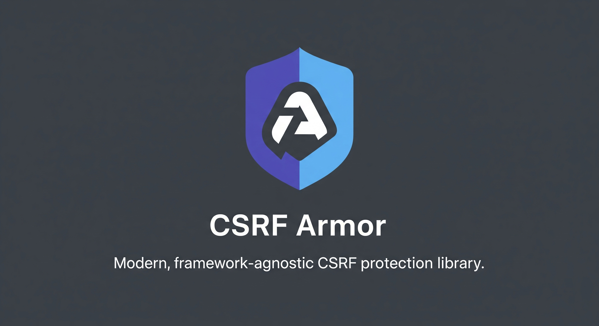

# @csrf-armor/nextjs



[](https://badge.fury.io/js/@csrf-armor%2Fnextjs)

Complete CSRF protection for Next.js applications with App Router support, middleware integration, and React hooks.

## Features

- ✅ **App Router & Pages Router** - Works with both Next.js routing systems
- 🛡️ **Multiple Security Strategies** - Choose from 5 different CSRF protection methods
- 🪝 **React Hooks** - `useCsrf` hook for easy client-side integration
- 🔄 **Automatic Token Management** - Handles token generation, validation, and refresh
- 🚀 **Edge Runtime Compatible** - Works in Vercel Edge Runtime and other edge environments
- 📱 **SSR & Client-Side** - Full support for server-side and client-side rendering
- 🎯 **TypeScript First** - Fully typed with comprehensive TypeScript support
- ⚡ **High Performance** - Event-driven updates, no wasteful polling

---

## Installation

```bash
npm install @csrf-armor/nextjs
# or
yarn add @csrf-armor/nextjs
# or
pnpm add @csrf-armor/nextjs
```

---

## Quick Start

### 1. Create Middleware

Create `middleware.ts` in your project root:

```typescript
import { NextResponse } from 'next/server';
import type { NextRequest } from 'next/server';
import { createCsrfMiddleware } from '@csrf-armor/nextjs';

const csrfProtect = createCsrfMiddleware({
  strategy: 'signed-double-submit',
  secret: process.env.CSRF_SECRET!, // Use a strong secret from env
});

export async function middleware(request: NextRequest) {
  const response = NextResponse.next();
  const result = await csrfProtect(request, response);

  if (!result.success) {
    // Log for security monitoring
    if (process.env.NODE_ENV === 'production') {
      console.warn('CSRF validation failed:', {
        url: request.url,
        method: request.method,
        reason: result.reason,
        ip: request.ip,
        userAgent: request.headers.get('user-agent'),
      });
    }

    return new NextResponse('CSRF validation failed', { 
      status: 403,
      headers: { 'Content-Type': 'text/plain' }
    });
  }

  return result.response;
}

export const config = {
  matcher: [
    // Protect all routes except static files and API routes that don't need protection
    '/((?!_next/static|_next/image|favicon.ico|api/auth).*)',
  ],
};
```

### 2. Add Environment Variable

Add to your `.env.local`:

```bash
CSRF_SECRET=your-super-secret-csrf-key-min-32-chars-long
```

### 3. Setup Context Provider

First, wrap your app with the CSRF provider:

```typescript
// app/layout.tsx or your root component
import { CsrfProvider } from '@csrf-armor/nextjs';

export default function RootLayout({
  children,
}: {
  children: React.ReactNode;
}) {
  return (
    <html lang="en">
      <body>
        <CsrfProvider config={{ cookieName: 'csrf-token' }}>
          {children}
        </CsrfProvider>
      </body>
    </html>
  );
}
```

### 4. Use in React Components

```typescript
'use client';
import { useCsrf } from '@csrf-armor/nextjs';

export function ContactForm() {
  const { csrfToken, csrfFetch, updateToken } = useCsrf();

  const handleSubmit = async (e: React.FormEvent<HTMLFormElement>) => {
    e.preventDefault();
    const formData = new FormData(e.currentTarget);

    try {
      const response = await csrfFetch('/api/contact', {
        method: 'POST',
        headers: { 'Content-Type': 'application/json' },
        body: JSON.stringify({
          name: formData.get('name'),
          email: formData.get('email'),
          message: formData.get('message'),
        }),
      });

      if (response.ok) {
        alert('Message sent successfully!');
      }
    } catch (error) {
      console.error('Failed to send message:', error);
    }
  };

  return (
    <form onSubmit={handleSubmit}>
      <input name="name" placeholder="Your Name" required />
      <input name="email" type="email" placeholder="Your Email" required />
      <textarea name="message" placeholder="Your Message" required />
      <button type="submit">Send Message</button>

      {/* Optional: Manual token refresh */}
      <button type="button" onClick={updateToken}>
        Refresh CSRF Token
      </button>

      {csrfToken && <small>Protected by CSRF token</small>}
    </form>
  );
}
```

### 5. API Route Example

```typescript
// app/api/contact/route.ts
import { NextRequest, NextResponse } from 'next/server';

export async function POST(request: NextRequest) {
  // CSRF validation happens automatically in middleware
  // If we reach here, the request is valid
  
  const data = await request.json();
  
  // Process the contact form...
  console.log('Contact form data:', data);
  
  return NextResponse.json({ 
    success: true, 
    message: 'Contact form submitted successfully' 
  });
}
```

---

## Security Strategies

### 1. Signed Double Submit (Recommended)

```typescript
const csrfProtect = createCsrfMiddleware({
  strategy: 'signed-double-submit',
  secret: process.env.CSRF_SECRET!,
});
```

**How it works:**
- Unsigned token sent in response header and client-accessible cookie
- Signed token stored in server-only httpOnly cookie for validation
- Client reads unsigned token from client cookie and includes it in request headers
- Server verifies signed server cookie contains same unsigned token as submitted

**Security:** Combines the benefits of cryptographic signing with double-submit protection.
Even if an attacker can read the client cookie, they cannot forge the server-side signed validation.

**Best for:** High-security applications, financial services, e-commerce

### 2. Double Submit Cookie

```typescript
const csrfProtect = createCsrfMiddleware({
  strategy: 'double-submit',
});
```

**How it works:**
- Same token stored in cookie and sent in header
- Relies on Same-Origin Policy for protection

**Best for:** General web applications, content management systems

### 3. Signed Token

```typescript
const csrfProtect = createCsrfMiddleware({
  strategy: 'signed-token',
  secret: process.env.CSRF_SECRET!,
  token: { expiry: 3600 }, // 1 hour
});
```

**How it works:**
- HMAC-signed tokens with expiration
- Stateless validation

**Best for:** APIs, microservices, stateless applications

### 4. Origin Check

```typescript
const csrfProtect = createCsrfMiddleware({
  strategy: 'origin-check',
  allowedOrigins: [
    'https://yourdomain.com',
    'https://www.yourdomain.com',
  ],
});
```

**How it works:**
- Validates Origin/Referer headers
- Allows requests only from specified origins

**Best for:** APIs with known client origins, mobile app backends

### 5. Hybrid Protection

```typescript
const csrfProtect = createCsrfMiddleware({
  strategy: 'hybrid',
  secret: process.env.CSRF_SECRET!,
  allowedOrigins: ['https://yourdomain.com'],
});
```

**How it works:**
- Combines signed token + origin validation
- Multiple layers of protection

**Best for:** Maximum security requirements, enterprise applications

---

## Configuration Options

```typescript
interface CsrfConfig {
  strategy?: 'double-submit' | 'signed-double-submit' | 'signed-token' | 'origin-check' | 'hybrid';
  secret?: string;                    // Required for signed strategies
  
  token?: {
    expiry?: number;                  // Token expiry in seconds (default: 3600)
    headerName?: string;              // Header name (default: 'x-csrf-token')
    fieldName?: string;               // Form field name (default: 'csrf_token')
  };
  
  cookie?: {
    name?: string;                    // Cookie name (default: 'csrf-token')
    secure?: boolean;                 // Secure flag (default: true in production)
    httpOnly?: boolean;               // HttpOnly flag (default: false)
    sameSite?: 'strict' | 'lax' | 'none'; // SameSite (default: 'lax')
    path?: string;                    // Path (default: '/')
    domain?: string;                  // Domain (optional)
    maxAge?: number;                  // Max age in seconds (optional)
  };
  
  allowedOrigins?: string[];          // Allowed origins for origin-check
  excludePaths?: string[];            // Paths to exclude from protection
  skipContentTypes?: string[];        // Content types to skip
}
```

---

## Advanced Usage

### Custom Error Handling

```typescript
// middleware.ts
export async function middleware(request: NextRequest) {
  const response = NextResponse.next();
  const result = await csrfProtect(request, response);

  if (!result.success) {
    // Custom error response
    return NextResponse.json(
      { 
        error: 'CSRF validation failed',
        reason: result.reason,
        timestamp: new Date().toISOString()
      },
      { status: 403 }
    );
  }

  return result.response;
}
```

### Excluding Specific Paths

```typescript
const csrfProtect = createCsrfMiddleware({
  strategy: 'signed-double-submit',
  secret: process.env.CSRF_SECRET!,
  excludePaths: [
    '/api/webhooks',     // Webhook endpoints
    '/api/public',       // Public API endpoints
    '/health',           // Health check endpoints
  ],
});
```

### Custom Cookie Configuration

```typescript
const csrfProtect = createCsrfMiddleware({
  strategy: 'signed-double-submit',
  secret: process.env.CSRF_SECRET!,
  cookie: {
    name: 'my-csrf-token',
    secure: process.env.NODE_ENV === 'production',
    httpOnly: false,        // Allow client-side access
    sameSite: 'strict',     // Strict same-site policy
    path: '/',
    maxAge: 60 * 60 * 24,  // 24 hours
  },
});
```

### Multiple CSRF Configurations

```typescript
// Different protection for different routes
import { NextRequest, NextResponse } from 'next/server';
import { createCsrfMiddleware } from '@csrf-armor/nextjs';

const apiCsrf = createCsrfMiddleware({
  strategy: 'signed-token',
  secret: process.env.CSRF_SECRET!,
});

const webCsrf = createCsrfMiddleware({
  strategy: 'signed-double-submit',
  secret: process.env.CSRF_SECRET!,
});

export async function middleware(request: NextRequest) {
  const response = NextResponse.next();
  const pathname = request.nextUrl.pathname;
  
  let result;
  if (pathname.startsWith('/api/')) {
    result = await apiCsrf(request, response);
  } else {
    result = await webCsrf(request, response);
  }

  if (!result.success) {
    return new NextResponse('CSRF validation failed', { status: 403 });
  }

  return result.response;
}
```

---

## React Hooks API

### CsrfProvider

Context provider that manages CSRF state with optimized performance.

```typescript
interface CsrfProviderProps {
  children: React.ReactNode;
  config?: CsrfClientConfig;
}

interface CsrfClientConfig {
  cookieName?: string;    // Cookie name to read token from (default: 'csrf-token')
  headerName?: string;    // Header name to send token in (default: 'x-csrf-token')
}
```

**Features:**
- ✅ Event-driven updates (no polling)
- ✅ Automatic token refresh from response headers
- ✅ Shared state across components
- ✅ Optimized re-renders with useMemo

**Usage:**
```typescript
<CsrfProvider config={{ cookieName: 'my-csrf', headerName: 'X-My-CSRF' }}>
  <App />
</CsrfProvider>
```

**Error Handling:**
Throws error if used without provider:
```typescript
// ❌ This will throw
const { csrfToken } = useCsrf(); // Error: must be within CsrfProvider

// ✅ Correct usage
<CsrfProvider>
  <MyComponent /> {/* useCsrf() works here */}
</CsrfProvider>
```

### useCsrf()

Hook for accessing CSRF functionality within a CsrfProvider.

```typescript
const { csrfToken, csrfFetch, updateToken } = useCsrf();
```

**Returns:**
- `csrfToken: string | null` - Current CSRF token (null if not available)
- `csrfFetch: (input, init?) => Promise<Response>` - Fetch function with automatic CSRF headers
- `updateToken: () => void` - Manually refresh token

**Automatic Updates:**
- When user returns to tab (visibility change)
- When window gains focus
- When localStorage 'csrf-token' changes
- When server responds with new token in headers

**Error Handling:**
```typescript
const { csrfFetch, updateToken } = useCsrf();

try {
  const response = await csrfFetch('/api/data', { method: 'POST' });
  if (response.status === 403) {
    // CSRF validation failed - token may be expired
    updateToken(); // Refresh and retry
  }
} catch (error) {
  console.error('Request failed:', error);
}
```

### Manual Token Management

```typescript
import { getCsrfToken, createCsrfHeaders, csrfFetch } from '@csrf-armor/nextjs';

// Get current token
const token = getCsrfToken();

// Create headers manually
const headers = createCsrfHeaders();

// Use csrfFetch directly
const response = await csrfFetch('/api/data', {
  method: 'POST',
  body: JSON.stringify({ data: 'example' }),
});
```

---

## TypeScript Support

Full TypeScript support with comprehensive type definitions:

```typescript
import type { 
  CsrfConfig, 
  CsrfStrategy, 
  CsrfProtectResult,
  CsrfClientConfig 
} from '@csrf-armor/nextjs';

const config: CsrfConfig = {
  strategy: 'signed-double-submit',
  secret: process.env.CSRF_SECRET!,
  cookie: {
    secure: true,
    sameSite: 'strict',
  },
};
```

---

## Error Handling

### Common Error Scenarios

```typescript
// Handle CSRF validation failures
export async function middleware(request: NextRequest) {
  const response = NextResponse.next();
  const result = await csrfProtect(request, response);

  if (!result.success) {
    // Log to console or external service (Sentry, DataDog, etc.)
    console.error('CSRF validation failed:', {
      reason: result.reason,
      url: request.url,
      method: request.method,
      userAgent: request.headers.get('user-agent'),
    });

    // Return appropriate error response
    return NextResponse.json(
      { error: 'CSRF validation failed' },
      { status: 403 }
    );
  }

  return result.response;
}
```

### Client-Side Error Handling

```typescript
const { csrfFetch, updateToken } = useCsrf();

try {
  const response = await csrfFetch('/api/data', {
    method: 'POST',
    body: JSON.stringify(data),
  });

  if (!response.ok) {
    if (response.status === 403) {
      // CSRF validation failed - try refreshing token
      console.warn('CSRF validation failed, refreshing token...');
      updateToken();
      // Optional: retry the request or reload page
      // window.location.reload();
    }
    throw new Error(`HTTP ${response.status}`);
  }

  const result = await response.json();
  // Handle success...
} catch (error) {
  console.error('Request failed:', error);
  // Handle error...
}
```

---

## Security Best Practices

### 1. Strong Secrets

```bash
# Generate a strong secret (32+ characters)
openssl rand -base64 32

# In your .env.local
CSRF_SECRET=your-generated-secret-here
```

> ### ⚠️ Never use the default secret in production!

### 2. Environment-Specific Configuration

```typescript
const csrfProtect = createCsrfMiddleware({
  strategy: 'signed-double-submit',
  secret: process.env.CSRF_SECRET!,
  cookie: {
    secure: process.env.NODE_ENV === 'production',
    sameSite: process.env.NODE_ENV === 'production' ? 'strict' : 'lax',
  },
});

// Add runtime secret validation
if (process.env.NODE_ENV === 'production' && process.env.CSRF_SECRET === 'default-secret-change-this') {
  throw new Error('CSRF_SECRET must be changed in production!');
}
```

### 3. Cookie Security Configuration

```typescript
const csrfProtect = createCsrfMiddleware({
  strategy: 'signed-double-submit',
  secret: process.env.CSRF_SECRET!,
  cookie: {
    secure: true,                    // HTTPS only in production
    sameSite: 'strict',             // Strongest protection
    httpOnly: false,                // Must be false for client access
    path: '/',                      
    // Optional: domain-specific
    domain: process.env.NODE_ENV === 'production' ? '.yourdomain.com' : undefined,
  },
});
```

**⚠️ Security Notes:**
- `httpOnly: false` is required for client cookie access but creates XSS risk
- Use `sameSite: 'strict'` for maximum protection (may break some integrations)
- Always use `secure: true` in production (requires HTTPS)
- Consider domain settings for subdomain cookie sharing

### 4. Security Headers

```typescript
// middleware.ts - Add security headers
export async function middleware(request: NextRequest) {
  const response = NextResponse.next();
  const result = await csrfProtect(request, response);

  if (result.success) {
    // Add additional security headers
    result.response.headers.set('X-Content-Type-Options', 'nosniff');
    result.response.headers.set('X-Frame-Options', 'DENY');
    result.response.headers.set('X-XSS-Protection', '1; mode=block');
  }

  return result.response;
}
```

### 5. Logging and Monitoring

```typescript
const csrfProtect = createCsrfMiddleware({
  strategy: 'signed-double-submit',
  secret: process.env.CSRF_SECRET!,
});

export async function middleware(request: NextRequest) {
  const response = NextResponse.next();
  const result = await csrfProtect(request, response);

  if (!result.success) {
    // Log security incidents
    console.warn('CSRF validation failed', {
      ip: request.ip,
      userAgent: request.headers.get('user-agent'),
      url: request.url,
      reason: result.reason,
      timestamp: new Date().toISOString(),
    });
  }

  return result.success ? result.response :
    new NextResponse('Forbidden', { status: 403 });
}
```

---

## Migration Guide

### From Other CSRF Libraries

If you're migrating from other CSRF protection libraries:

1. **Remove old CSRF middleware**
2. **Install @csrf-armor/nextjs**
3. **Update middleware.ts**
4. **Replace client-side CSRF code with hooks**

### From Pages Router to App Router

```typescript
// Before (Pages Router with API routes)
// pages/api/_middleware.ts or pages/api/[...all].ts

// After (App Router)
// middleware.ts in project root
import { createCsrfMiddleware } from '@csrf-armor/nextjs';

const csrfProtect = createCsrfMiddleware({
  strategy: 'signed-double-submit',
  secret: process.env.CSRF_SECRET!,
});

export async function middleware(request: NextRequest) {
  // Middleware runs on all routes by default
  const response = NextResponse.next();
  const result = await csrfProtect(request, response);
  
  return result.success ? result.response : 
    new NextResponse('Forbidden', { status: 403 });
}
```

---

## Troubleshooting

### Common Issues

**1. "useCsrf must be used within a CsrfProvider"**
- **Solution:** Wrap your app with `<CsrfProvider>`
- Make sure the provider is above all components using `useCsrf()`

**2. "No CSRF token found" with signed-double-submit**
- Check that cookies are enabled in the browser
- Verify the client cookie is not httpOnly
- Ensure both client and server cookies are set correctly

**3. Tokens not updating automatically**
- The hooks use event-driven updates
- Manual refresh: call `updateToken()` from the hook
- Check browser console for JavaScript errors

**4. "CSRF validation failed" on legitimate requests**
- Ensure cookies are enabled in the browser
- Check that the domain/path settings are correct
- Verify the secret is consistent across deployments

**5. Tokens not being included in requests**
- Make sure you're using `csrfFetch` or manually adding headers
- Check that the client cookie is accessible (httpOnly: false for client access)
- Verify the component is client-side (`'use client'`)

### Debug Mode

```typescript
const csrfProtect = createCsrfMiddleware({
  strategy: 'signed-double-submit',
  secret: process.env.CSRF_SECRET!,
});

export async function middleware(request: NextRequest) {
  const response = NextResponse.next();
  const result = await csrfProtect(request, response);

  // Debug logging in development
  if (process.env.NODE_ENV === 'development') {
    console.log('CSRF Debug:', {
      success: result.success,
      reason: result.reason,
      token: result.token,
      method: request.method,
      url: request.url,
    });
  }

  return result.success ? result.response : 
    new NextResponse('Forbidden', { status: 403 });
}
```

### Client-Side Debugging

```typescript
import { getCsrfToken } from '@csrf-armor/nextjs';

// Check if token is available
const token = getCsrfToken();
if (!token) {
  console.warn('No CSRF token found. Make sure cookies are enabled.');
}

// Monitor token changes in development
if (process.env.NODE_ENV === 'development') {
  setInterval(() => {
    const currentToken = getCsrfToken();
    console.log('Current CSRF token:', currentToken);
  }, 5000);
}
```

---

## License

MIT © [Muneeb Samuels](https://github.com/muneebs)

## Related Packages

- [@csrf-armor/core](../core) - Framework-agnostic CSRF protection

---

## 🙏 Acknowledgements

This project is inspired by the excellent work done by [@amorey](https://github.com/amorey) on [edge-csrf](https://github.com/amorey/edge-csrf). Their approach to CSRF protection in edge environments has significantly influenced the development of csrf-armor.
